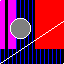

@ArashGh

# Pixelator

## What is it?

Pixelator is a Unity package which allows you to generate and design pixel art programmatically. (this is for now, automatic generation is on the way)

## Who is it for?

I mainly started developing this package because I'm not an artist and sometimes I feel much easier expressing what I want in my game art with code.

# Install

- Open Unity Package Manager
- Click the "+" icon and choose "add package from git url"
- Enter "https://github.com/ArashGh/Unity-Pixelator.git"
- Apply

# Example

```c#
    public class BasicImageManipulation : MonoBehaviour
    {
        Image image;

        void Start()
        {
            //============Uncomment to time the operations
            //Stopwatch sw = new Stopwatch();
            //sw.Start();

            // Creating a new Image
            image = new Image(64, 64, false);

            // Each Image starts with a layer called "Base"
            // You can access different layers of an Image using the [] (bracket) operator and passing the layer name
            // SetPixelColor can be used on any layer to set individual pixel color
            image["Base"].SetPixelColor(63, 0, Color.cyan);
            image["Base"].SetPixelColor(0, 63, Color.cyan);

            // You can add new layers to the image
            // There are several methods to help you do that
            // => InsertLayerOnTop, InsertLayerOnBottom, InsertLayerUnder, InsertLayerAbove
            image.InsertLayerOnTop("Top");
            image["Top"].SetPixelColor(63, 0, Color.white);
            image["Top"].SetPixelColor(0, 63, Color.white);

            image.InsertLayerOnBottom("Background");
            image["Background"].Fill(Color.black);

            image.InsertLayerUnder("HiddenUnder", "Background");
            image["HiddenUnder"].Fill(Color.red);

            image.InsertLayerAbove("Pattern", "Background");

            // You can set and manipulate pixels on a layer in any way you want
            for (int i = 0; i < 64 * 64; i++)
            {
                if (i % 4 == 0)
                    image["Pattern"].SetPixelColor(i % 64, i / 64, Color.blue);
            }

            // The Primitive2D class helps you draw simple shapes such as Lines and Circles
            Primitive2D.DrawLine(image["Top"], new Vector2Int(0, 0), new Vector2Int(63, 42), Color.white, false);
            Primitive2D.DrawCircle(image["Top"], new Vector2Int(20, 35), 10, Color.white, true, Color.grey);

            // There is a Selection system with basic tools for now. (WIP)
            // There are 3 different Selection modes. (Default is Replace any previous selection)
            // => Remove (Removes the new selection from the previous selection)
            // => Replace (Replaces the old selection with the new selected pixels) (This is the default behaviour if you don't specify the selection type)
            // => Add (Adds the new selection to the previous selection)

            // RectangleSelect lets you select a rectangular area
            image["Pattern"].RectangleSelect(new Vector2Int(35, 15), new Vector2Int(63, 63));

            // You can then fill the selected pixels with the color you like
            image["Pattern"].FillSelection(Color.red);

            image["Pattern"].RectangleSelect(new Vector2Int(0, 63), new Vector2Int(15, 15));

            // MagicSelect lets you select the connected pixels with the same color starting from the position you specify (You know what magic wand does, right?)
            image["Pattern"].MagicSelect(new Vector2Int(5, 0), SelectionType2D.Remove);
            image["Pattern"].FillSelection(Color.magenta);

            // The Render method on Image or Layer object will render the pixel color buffer to a Texture2D inside the object
            image.Render();

            //============Uncomment to time the operations
            //sw.Stop();
            //print($"{sw.ElapsedMilliseconds}");
            //sw.Restart();


            // The ExportRenderedImage on the Image objects or Layer objects lets you export the corrosponding Image or Layer's content to a png file at the location you specify
            image.ExportRenderedImage(Path.Combine(Application.dataPath, "test.png"));

            //============Uncomment to time the operations
            //sw.Stop();
            //print($"{sw.ElapsedMilliseconds}");
        }

        private void OnGUI()
        {
            // This is just for demonstration purposes
            // You can Access the final Image or Layer rendered texture using the GetRenderedTexture method
            GUI.DrawTexture(new Rect((Screen.width - image.Width * 4) / 2, (Screen.height - image.Height * 4) / 2, image.Width * 4, image.Height * 4), image.GetRenderedTexture());
        }
    }
```

## Sample Output


# Community
If you have any suggestions or you found a problem in the package don't hesitate to tell me in [The Discussion](https://github.com/ArashGh/Unity-Pixelator/discussions) section.

# License
For license information please refer to (see [LICENSE](LICENSE.md))